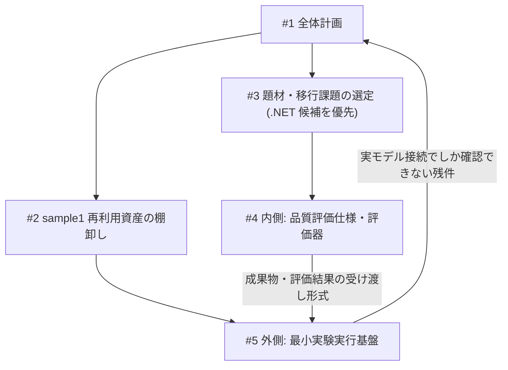

# 全体計画：モダナイズ実験環境の再構成と品質評価の成立確認

対応 Issue: [#1](https://github.com/fukuda-yuki/sample2/issues/1)
状態: 計画。以下の実装方法・作業順序は**提案**であり、合意済みの仕様として扱わない。未決定事項は未決定のまま残す。

## 1. 研究目的と現在の方向性

ソフトウェア開発における Context Engineering、特に**モデルが実際に受け取る Input コンテキスト**に着目する。既存研究・ベンチマーク・実務上の評判で示された効果が、既存システムのモダナイズでも再現するかを確かめ、成功・失敗と情報の投入・取得・保持の関係を追えるようにする。

維持する前提:

- 主な主張・評価はコンテキストと Run 全体の input/output token に置く。金銭的費用は背景であり、API 料金最小化へ置き換えない。
- 品質低下や早期終了によるトークン減少を改善とみなさない。
- 既存研究に近い再現・拡張研究を排除しない。「日本企業固有」を成立条件にしない。
- 0→1 の新規開発ではなく、既存システムのモダナイズを対象とする。

## 2. 決定事項と未決定事項

### 決定事項（ユーザー判断として記録）

| # | 決定 | 記録 |
| --- | --- | --- |
| D-1 | 新しい作業先は `fukuda-yuki/sample2`。 | #1 |
| D-2 | `sample1` の基盤を生かしつつ、新しい目的に合わせて組み直す。旧実験の前提は持ち込まない。 | #1 |
| D-3 | 評価機の整備と検証テーマの検討を並行して進める。 | #1 |
| D-4 | **最初の題材は .NET 候補（Lv.1: MVC Music Store / `net48`）を対象とする。** | 本 Issue へのユーザー指示（2026-09-15） |
| D-5 | 外側と内側はまず同一管理リポジトリ内で責務を分ける。研究管理領域と実装エージェントの作業領域を分離する。 | #1 |

### 未決定事項（今回決めない）

- 移行先言語・ランタイムの一般方針（Java・COBOL 候補の扱いを含む）
- 全面移行か部分移行か、最初の課題の対象範囲（→ #3 で仮決定）
- クラウド配備
- 利用エージェント・モデル、介入条件、反復数
- 品質非劣化の判定基準
- 比較テーマ（必要情報を残したまま周辺情報を追加する比較／初期投入と自律探索の比較／コードへの説明追加など）

D-4 は**対象を .NET に絞る**決定であり、題材の採用確定・移行範囲の確定・実行開始の決定ではない。採用判断は #3 の比較結果とユーザー判断を経る。

## 3. 外側・内側の責務分界

| 区分 | 責務 | 本リポジトリでの実体 |
| --- | --- | --- |
| 外側：実験実行基盤 | 開始状態の用意、条件適用、エージェント実行、停止、成果物固定、使用量・ログの回収、採点呼び出し、保存・再集計。測定手順と記録の信頼性を担う。 | `outer/` |
| 内側①：品質評価仕様 | 何を正解とするか、何を維持し何を変更してよいか、入力・初期状態・期待結果・観測対象を定義する。 | `inner/spec/` |
| 内側②：品質評価器 | 評価仕様を実装し、要求を満たす成果物を通し、重要な誤りを持つ成果物を落とせることを確認する。 | `inner/evaluator/` |

原則:

- **外側が動くだけで品質評価が妥当とはいえない。既存テストがあるだけで内側が完成しているともいえない。**
- 品質の正解基準は内側にのみ置く。外側で独自に合否や配点を作らない。
- 外側は内側の完成を待たない。先に合意するのは**受け渡し形式**（固定成果物、課題・環境・評価版、評価結果と根拠）だけとし、内側は手動起動でも検証できるようにする。
- 外側と内側は測定対象（実装成果物）を共有するが、**評価器は実装エージェントから取得・変更できない領域に置く**。

## 4. 再構成方針（`sample1` との関係）

- `sample1` は旧実験の保存・参照元として残す。**旧データ・判断履歴を新実験に混ぜない。**
- 移植は「必要な基盤・テスト・知見を選んで移植する」を第一候補とし、単純コピーも全面書き直しも先に決めない。実際の切り出し可否は [#2](https://github.com/fukuda-yuki/sample2/issues/2) で調査する。
- 移植元コミット、ファイル、変更点、再利用した検証と再検証が必要な範囲を残す。
- `normal` / `anti`、AP-001、旧採点分母、旧実行許可などを新実験の仕様として持ち込まない。
- `local-agent-monitor` は**測定手段**、`misc` は**研究本体**として扱う。どちらの再開発も本計画の目的にしない。
- 旧実験で「文書がある」ことと「実環境で検証済み」であることを混同しない。過去の不具合・停止記録は現在の修正状態と区別して記録する。

## 5. 個別 Issue の関係



- **#2 と #3 は並行可能。** #2 は題材に依存しない。D-4 により #3 は .NET 候補を先に詰める。
- #4 の課題固有部分は #3 の仮決定後。ただし**課題に依存しない評価器の骨格（起動・観測・判定・記録・再採点）は先に作れる**。
- #5 の移植範囲は #2 の調査結果を踏まえて決める。
- #4 と #5 は、外側の完全自動化を待たず、内側を手動起動でも検証できるようにする。

## 6. 本リポジトリの構成

```text
docs/          研究管理ドキュメント（計画・調査・選定・仕様・判断履歴）
inner/         内側: 品質評価仕様 (spec/)、評価器 (evaluator/)、校正 fixture (fixtures/)、結果 (results/)
outer/         外側: 実行基盤。開始状態の用意・実行・停止・固定・採点呼び出し・記録・再集計
runs/          実装エージェントの作業領域と固定成果物（追跡しない）
```

`runs/` は `.gitignore` により追跡しない。実装役へ渡すのは当該条件で許された入力のみとし、研究管理領域（`docs/` の一部、`inner/`）と非公開評価資材は渡さない。

## 7. 最初の到達点（完了条件ではない）

1 課題で評価が成立するかを確かめる。次の 5 点を満たした時点を最初の到達点とする。

- [ ] 最初の題材・移行課題について、採用理由、保留点、ユーザー判断が記録されている。
- [ ] 品質評価の対象・限界・期待結果の根拠が説明できる。
- [ ] 妥当な成果物、重要な誤りを持つ成果物、評価器障害を区別する検証記録がある。
- [ ] 同じ固定成果物を再採点でき、成果物・評価版・結果の対応を追える。
- [ ] 実モデル比較へ進む条件と、見直すべき条件を示せる。差の発生やトークン減少を開始条件にしない。

## 8. 今回実施しないこと

全 3 教材への同時対応、全機能の移植、汎用ライブラリ化、専用ダッシュボード、自動原因分類・自己改善ツールの構築、クラウド配備、**実モデルによる比較実験の開始**。`sample1` の旧実験・履歴・原本の変更。

## 9. 参照

- `sample1` 参照コミット: `aa76384654bd64bf38cc5a9ada486fb8d3a559ca`（調査基点。移植元の採用版を確定したものではない）
- [sample1 README](https://github.com/fukuda-yuki/sample1/blob/aa76384654bd64bf38cc5a9ada486fb8d3a559ca/README.md)
- [sample1 検証の意味を確認する実行手順](https://github.com/fukuda-yuki/sample1/blob/aa76384654bd64bf38cc5a9ada486fb8d3a559ca/docs/meaningful-evaluation.md)
- [研究本体 misc](https://github.com/fukuda-yuki/misc) / [測定手段 local-agent-monitor](https://github.com/fukuda-yuki/local-agent-monitor)
